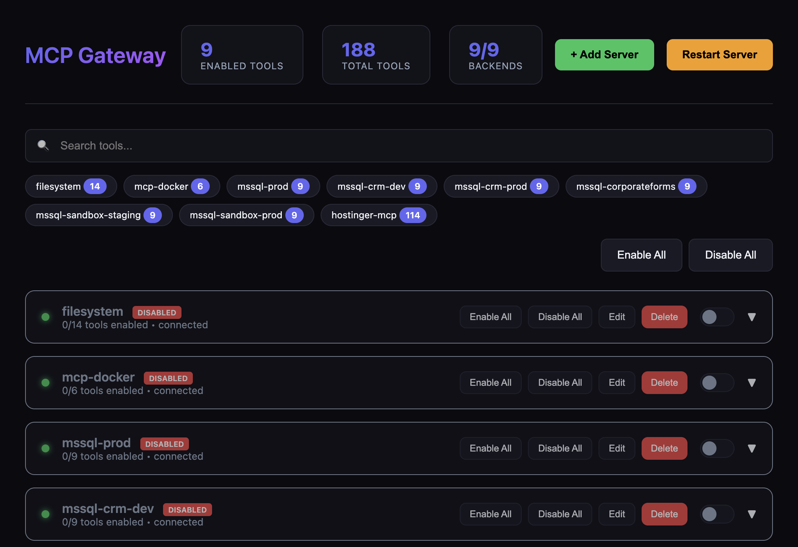

# MCP Gateway

A universal Model Context Protocol (MCP) Gateway that aggregates multiple MCP servers and exposes them through a single endpoint. Works with all major MCP clients:

- ✅ **Claude Desktop / Claude Code**
- ✅ **Cursor**
- ✅ **OpenAI Codex**
- ✅ **VS Code Copilot**


## What's New (v1.0.0)

- **Gateway MCP Tools** - All code execution features now exposed as MCP tools (`gateway_*`) that any client can discover and use directly
- **Hot-Reload Server Management** - Add, edit, and delete MCP servers from the dashboard without restarting
- **UI State Persistence** - Disabled tools and backends are remembered across server restarts
- **Enhanced Dashboard** - Reconnect failed backends, view real-time status, improved error handling
- **Connection Testing** - Test server connections before adding them to your configuration
- **Export/Import Config** - Backup and share your server configurations easily
- **Parallel Tool Execution** - Execute multiple tool calls simultaneously for better performance
- **Result Filtering & Aggregation** - Reduce context bloat with `maxRows`, `fields`, `format`, and aggregation options

## Features

### Core Gateway Features
- 🔀 **Multi-Server Aggregation** - Route multiple MCP servers through one gateway
- 🎛️ **Web Dashboard** - Real-time UI to manage tools, backends, and server lifecycle
- ➕ **Hot-Reload Server Management** - Add, edit, delete MCP servers from dashboard without restart
- 🌐 **HTTP Streamable Transport** - Primary transport, works with all clients
- 📡 **SSE Transport** - Backward compatibility for older clients
- 🔐 **Authentication** - API Key and OAuth/JWT support
- ⚡ **Rate Limiting** - Protect your backend servers
- 🐳 **Docker Ready** - Easy deployment with Docker/Compose
- 📊 **Health Checks** - Monitor backend status with detailed diagnostics
- 🔄 **Auto-Restart** - Server restarts automatically on crash or via dashboard
- 💾 **UI State Persistence** - Remembers disabled tools/backends across restarts

### Code Execution Mode (Token-Efficient AI)
Inspired by [Anthropic's Code Execution with MCP](https://www.anthropic.com/engineering/code-execution-with-mcp) - achieve up to **98.7% token reduction**:

- 🔍 **Progressive Tool Disclosure** - Search and lazy-load tools to reduce token usage
- 💻 **Sandboxed Code Execution** - Execute TypeScript/JavaScript in secure Node.js VM
- 📉 **Context-Efficient Results** - Filter, aggregate, and transform tool results
- 🔒 **Privacy-Preserving Operations** - PII tokenization for sensitive data
- 📁 **Skills System** - Save and reuse successful code patterns
- 🗄️ **State Persistence** - Workspace for agent state across sessions
- 🛠️ **Gateway MCP Tools** - All code execution features exposed as MCP tools for any client

### Monitoring & Observability
- 📈 **Prometheus Metrics** - Tool call latency, error rates, cache performance
- 📊 **JSON Metrics API** - Programmatic access to gateway statistics
- 💾 **Result Caching** - LRU cache with TTL for tool results
- 📝 **Audit Logging** - Track sensitive operations

## Screenshots

### Dashboard Overview


### Tools Management


### Add Server Dialog


## Quick Start

### 1. Install Dependencies

```bash
npm install
```

### 2. Configure Backend Servers

Copy the example config and edit it:

```bash
cp config/servers.example.json config/servers.json
```

Edit `config/servers.json` to add your MCP servers:

```json
{
  "servers": [
    {
      "id": "filesystem",
      "name": "Filesystem",
      "enabled": true,
      "transport": {
        "type": "stdio",
        "command": "npx",
        "args": ["-y", "@modelcontextprotocol/server-filesystem", "/path/to/dir"]
      },
      "toolPrefix": "fs"
    }
  ]
}
```

### 3. Start the Gateway

```bash
# Development
npm run dev

# Production
npm run build
npm start
```

The gateway will start on `http://localhost:3010` by default.

#### Security modes

For local experimentation you can run without auth:

- `AUTH_MODE=none`

However, **sensitive endpoints** (`/dashboard`, `/dashboard/api/*`, `/api/code/*`, `/metrics/json`) are blocked by default when `AUTH_MODE=none`. To allow unauthenticated access (not recommended except for isolated local use), explicitly opt in:

- `ALLOW_INSECURE=1`

For secure usage, prefer:

- `AUTH_MODE=api-key` with `API_KEYS=key1,key2`
- or `AUTH_MODE=oauth` with the appropriate `OAUTH_*` settings shown below.

## Endpoints

### Core Endpoints

| Endpoint | Transport | Use Case |
|----------|-----------|----------|
| `/mcp` | HTTP Streamable | Primary endpoint - works with all clients |
| `/sse` | Server-Sent Events | Backward compatibility |
| `/health` | JSON | Health checks and status |
| `/dashboard` | Web UI | Manage tools, backends, and restart server |
| `/metrics` | Prometheus | Prometheus-format metrics |
| `/metrics/json` | JSON | JSON-format metrics |

### Code Execution API

| Endpoint | Method | Description |
|----------|--------|-------------|
| `/api/code/tools/search` | GET | Search tools with filters |
| `/api/code/tools/tree` | GET | Get filesystem-like tool tree |
| `/api/code/tools/names` | GET | Get all tool names (minimal tokens) |
| `/api/code/tools/:name/schema` | GET | Lazy-load specific tool schema |
| `/api/code/tools/stats` | GET | Tool statistics by backend |
| `/api/code/sdk` | GET | Auto-generated TypeScript SDK |
| `/api/code/execute` | POST | Execute code in sandbox |
| `/api/code/tools/:name/call` | POST | Call tool with result filtering |
| `/api/code/tools/:name/call/aggregate` | POST | Call tool with aggregation |
| `/api/code/tools/parallel` | POST | Execute multiple tools in parallel |
| `/api/code/skills` | GET/POST | List or create skills |
| `/api/code/skills/search` | GET | Search skills |
| `/api/code/skills/:name` | GET/DELETE | Get or delete skill |
| `/api/code/skills/:name/execute` | POST | Execute a skill |
| `/api/code/workspace/session` | GET/POST | Get or update session state |
| `/api/code/cache/stats` | GET | Cache statistics |
| `/api/code/cache/clear` | POST | Clear cache |

### Dashboard API

| Endpoint | Method | Description |
|----------|--------|-------------|
| `/dashboard/api/tools` | GET | Get all tools with enabled status |
| `/dashboard/api/backends` | GET | Get all backends with status |
| `/dashboard/api/tools/:name/toggle` | POST | Toggle tool enabled/disabled |
| `/dashboard/api/backends/:id/toggle` | POST | Toggle backend enabled/disabled |
| `/dashboard/api/backends/:id/reconnect` | POST | Reconnect a failed backend |
| `/dashboard/api/backends` | POST | Add new backend server |
| `/dashboard/api/backends/:id` | PUT | Update backend configuration |
| `/dashboard/api/backends/:id` | DELETE | Remove backend server |
| `/dashboard/api/config/export` | GET | Export server configuration |
| `/dashboard/api/config/import` | POST | Import server configuration |
| `/dashboard/api/restart` | POST | Restart the gateway server |

## Dashboard

Access the web dashboard at `http://localhost:3010/dashboard` to:

- View all connected backends and their real-time status
- **Add new MCP servers** with connection testing (STDIO, HTTP, SSE transports)
- **Edit existing servers** (modify command, args, environment variables)
- **Delete servers** with graceful disconnect
- Enable/disable individual tools or entire backends
- Search and filter tools across all backends
- **Export/import configuration** for backup and sharing
- **Reconnect failed backends** with one click
- Restart the entire gateway server
- View tool counts and backend health at a glance

The dashboard persists UI state (disabled tools/backends) across server restarts.

## Client Configuration

### Claude Desktop / Claude Code

1. Open Claude Desktop → **Settings** → **Connectors**
2. Click **Add remote MCP server**
3. Enter your gateway URL:

```
http://your-gateway-host:3010/mcp
```

4. Complete authentication if required

> **Note:** Claude requires adding remote servers through the UI, not config files.

### Cursor

1. Open Cursor → **Settings** → **Features** → **MCP**
2. Click **Add New MCP Server**
3. Choose **Type**: `HTTP` or `SSE`
4. Enter your gateway URL:

For HTTP (recommended):
```
http://your-gateway-host:3010/mcp
```

For SSE:
```
http://your-gateway-host:3010/sse
```

Or add to your Cursor settings JSON:

```json
{
  "mcpServers": {
    "my-gateway": {
      "type": "http",
      "url": "http://your-gateway-host:3010/mcp"
    }
  }
}
```

### OpenAI Codex

#### Option 1: CLI

```bash
codex mcp add my-gateway --transport http --url https://your-gateway-host:3010/mcp
```

#### Option 2: Config File

Add to `~/.codex/config.toml`:

```toml
[mcp_servers.my_gateway]
type = "http"
url = "https://your-gateway-host:3010/mcp"

# With API key authentication
# headers = { Authorization = "Bearer your-api-key-here" }
```

> **Important:** Codex requires **HTTPS** for remote servers and only supports HTTP Streamable (not SSE).

### VS Code Copilot

1. Open Command Palette (`Cmd/Ctrl + Shift + P`)
2. Run **MCP: Add MCP Server**
3. Choose **Remote (URL)**
4. Enter your gateway URL:

```
http://your-gateway-host:3010/mcp
```

5. Approve the trust prompt

Or add to your VS Code `settings.json`:

```json
{
  "mcp.servers": {
    "my-gateway": {
      "type": "http",
      "url": "http://your-gateway-host:3010/mcp"
    }
  }
}
```

## Backend Server Configuration

The gateway can connect to MCP servers using different transports:

### STDIO (Local Process)

```json
{
  "id": "filesystem",
  "name": "Filesystem Server",
  "enabled": true,
  "transport": {
    "type": "stdio",
    "command": "npx",
    "args": ["-y", "@modelcontextprotocol/server-filesystem", "/path/to/dir"],
    "env": {
      "SOME_VAR": "${ENV_VAR_NAME}"
    }
  },
  "toolPrefix": "fs",
  "timeout": 30000
}
```

### HTTP (Remote Server)

```json
{
  "id": "remote-server",
  "name": "Remote MCP Server",
  "enabled": true,
  "transport": {
    "type": "http",
    "url": "https://remote-mcp-server.com/mcp",
    "headers": {
      "Authorization": "Bearer ${REMOTE_API_KEY}"
    }
  },
  "toolPrefix": "remote",
  "timeout": 60000
}
```

### Tool Prefixing

Use `toolPrefix` to namespace tools from different servers:

- Server with `toolPrefix: "fs"` exposes `read_file` as `fs_read_file`
- Prevents naming collisions between servers
- Makes it clear which server handles each tool

## Authentication

### API Key Authentication

Set environment variables:

```bash
AUTH_MODE=api-key
API_KEYS=key1,key2,key3
```

Clients send the key in the Authorization header:

```
Authorization: Bearer your-api-key
```

### OAuth Authentication

```bash
AUTH_MODE=oauth
OAUTH_ISSUER=https://your-oauth-provider.com
OAUTH_AUDIENCE=mcp-gateway
OAUTH_JWKS_URI=https://your-oauth-provider.com/.well-known/jwks.json
```

## Docker Deployment

### Build and Run

```bash
# Build the image
docker build -t mcp-gateway .

# Run with environment variables
docker run -d \
  -p 3010:3010 \
  -v $(pwd)/config/servers.json:/app/config/servers.json:ro \
  -e AUTH_MODE=api-key \
  -e API_KEYS=your-secret-key \
  mcp-gateway
```

### Docker Compose

```bash
# Start
docker-compose up -d

# View logs
docker-compose logs -f

# Stop
docker-compose down
```

## Environment Variables

| Variable | Default | Description |
|----------|---------|-------------|
| `PORT` | `3010` | Server port |
| `HOST` | `0.0.0.0` | Server host |
| `LOG_LEVEL` | `info` | Log level (debug, info, warn, error) |
| `GATEWAY_NAME` | `mcp-gateway` | Gateway name in MCP responses |
| `AUTH_MODE` | `none` | Authentication mode (none, api-key, oauth) |
| `API_KEYS` | - | Comma-separated API keys |
| `OAUTH_ISSUER` | - | OAuth token issuer |
| `OAUTH_AUDIENCE` | - | OAuth audience |
| `OAUTH_JWKS_URI` | - | OAuth JWKS endpoint |
| `CORS_ORIGINS` | `http://localhost:3010,http://127.0.0.1:3010` | Allowed CORS origins (`*` to allow all) |
| `HEALTH_REQUIRE_BACKENDS` | `0` | If `1`, `/health` returns `503` when all configured backends are down |
| `ALLOW_INSECURE` | `0` | If `1`, allow unauthenticated access to dashboard, code APIs, and JSON metrics when `AUTH_MODE=none` |
| `RATE_LIMIT_WINDOW_MS` | `60000` | Rate limit window (ms) |
| `RATE_LIMIT_MAX_REQUESTS` | `100` | Max requests per window |

## Health Check

```bash
curl http://localhost:3010/health
```

Response:

```json
{
  "status": "ok",
  "gateway": "mcp-gateway",
  "backends": {
    "connected": 2,
    "total": 3,
    "details": {
      "filesystem": {
        "status": "connected",
        "toolCount": 5,
        "resourceCount": 0,
        "promptCount": 0
      }
    }
  },
  "tools": 10,
  "resources": 0,
  "prompts": 0
}
```

## Architecture

```
┌─────────────────────────────────────────────────────────────────┐
│                          MCP Clients                            │
│  (Claude Desktop, Cursor, Codex, VS Code)                       │
└─────────────────────────────────────────────────────────────────┘
                                │
                    HTTP Streamable / SSE
                                │
                                ▼
┌─────────────────────────────────────────────────────────────────┐
│                        MCP Gateway                              │
│  ┌─────────────┐  ┌──────────────┐  ┌────────────────────────┐  │
│  │   Auth      │  │ Rate Limit   │  │   Protocol Handler     │  │
│  │  Middleware │──│  Middleware  │──│  (Aggregates Tools)    │  │
│  └─────────────┘  └──────────────┘  └────────────────────────┘  │
│                                              │                   │
│                         ┌────────────────────┼────────────────┐  │
│                         │                    │                │  │
│                         ▼                    ▼                ▼  │
│              ┌──────────────────┐ ┌──────────────────┐ ┌──────┐ │
│              │  STDIO Backend   │ │  HTTP Backend    │ │ ...  │ │
│              │  (Local Process) │ │  (Remote Server) │ │      │ │
│              └──────────────────┘ └──────────────────┘ └──────┘ │
└─────────────────────────────────────────────────────────────────┘
                         │                    │
                         ▼                    ▼
              ┌──────────────────┐ ┌──────────────────┐
              │  Local MCP       │ │  Remote MCP      │
              │  Server          │ │  Server          │
              └──────────────────┘ └──────────────────┘
```

## Code Execution Mode

The Code Execution Mode allows AI agents to write and execute code instead of making individual tool calls, achieving up to **98.7% token reduction** for complex workflows.

### Gateway MCP Tools

All code execution features are exposed as MCP tools that any client can use directly. When connected to the gateway, clients automatically get these tools:

| Tool | Description |
|------|-------------|
| `gateway_list_tool_names` | Get all tool names (minimal tokens) |
| `gateway_search_tools` | Search tools by name, description, or backend |
| `gateway_get_tool_schema` | Lazy-load specific tool schema |
| `gateway_get_tool_tree` | Get tools organized by backend |
| `gateway_get_tool_stats` | Get statistics about tools |
| `gateway_execute_code` | Execute TypeScript/JavaScript in sandbox |
| `gateway_call_tool_filtered` | Call any tool with result filtering |
| `gateway_call_tool_aggregate` | Call tool with aggregation (count, sum, avg, etc.) |
| `gateway_call_tools_parallel` | Execute multiple tools in parallel |
| `gateway_list_skills` | List saved code patterns |
| `gateway_search_skills` | Search skills by name/tags |
| `gateway_get_skill` | Get skill details and code |
| `gateway_execute_skill` | Execute a saved skill |
| `gateway_create_skill` | Save a new reusable skill |

### Progressive Tool Disclosure

Instead of loading all tool definitions upfront (which can consume excessive tokens with 300+ tools), use progressive disclosure:

```bash
# Get just tool names (minimal tokens)
curl http://localhost:3010/api/code/tools/names

# Search for specific tools
curl "http://localhost:3010/api/code/tools/search?query=database&backend=mssql"

# Get filesystem-like tree view
curl http://localhost:3010/api/code/tools/tree

# Lazy-load specific tool schema when needed
curl http://localhost:3010/api/code/tools/mssql_execute_query/schema
```

Detail levels for search:
- `name_only` - Just tool names
- `name_description` - Names with descriptions
- `full_schema` - Complete JSON schema

### Sandboxed Code Execution

Execute TypeScript/JavaScript code in a secure Node.js VM sandbox:

```bash
curl -X POST http://localhost:3010/api/code/execute \
  -H "Content-Type: application/json" \
  -d '{
    "code": "const data = await mssql.executeQuery({ query: \"SELECT * FROM users\" });\nconst active = data.filter(u => u.active);\nconsole.log(`Found ${active.length} active users`);",
    "timeout": 30000
  }'
```

The sandbox:
- Auto-generates TypeScript SDK from your MCP tools
- Supports async/await, loops, and conditionals
- Returns only `console.log` output (not raw data)
- Has configurable timeout protection

### Context-Efficient Results

Reduce context bloat from large tool results:

```bash
# Call tool with filtering
curl -X POST http://localhost:3010/api/code/tools/mssql_get_table_data/call \
  -H "Content-Type: application/json" \
  -d '{
    "args": { "tableName": "users" },
    "options": {
      "maxRows": 10,
      "fields": ["id", "name", "email"],
      "format": "summary"
    }
  }'

# Call with aggregation
curl -X POST http://localhost:3010/api/code/tools/mssql_get_table_data/call/aggregate \
  -H "Content-Type: application/json" \
  -d '{
    "args": { "tableName": "orders" },
    "aggregation": {
      "operation": "groupBy",
      "field": "status",
      "countField": "count"
    }
  }'
```

Available aggregations: `count`, `sum`, `avg`, `min`, `max`, `groupBy`, `distinct`

### Privacy-Preserving Operations

Automatically tokenize PII so sensitive data never enters model context:

```bash
curl -X POST http://localhost:3010/api/code/execute \
  -H "Content-Type: application/json" \
  -d '{
    "code": "const users = await mssql.executeQuery({ query: \"SELECT * FROM users\" });\nconsole.log(users);",
    "privacy": {
      "tokenize": true,
      "patterns": ["email", "phone", "ssn", "credit_card"]
    }
  }'
```

Output shows tokenized values:
```
[{ name: "John", email: "[EMAIL_1]", phone: "[PHONE_1]" }]
```

Tokens are automatically untokenized when data flows to another tool.

### Skills System

Save successful code patterns as reusable skills:

```bash
# Create a skill
curl -X POST http://localhost:3010/api/code/skills \
  -H "Content-Type: application/json" \
  -d '{
    "name": "export-active-users",
    "description": "Export active users to CSV",
    "code": "const users = await mssql.executeQuery({ query: \"SELECT * FROM users WHERE active = 1\" });\nreturn users;",
    "parameters": {
      "type": "object",
      "properties": {
        "limit": { "type": "number", "default": 100 }
      }
    }
  }'

# List all skills
curl http://localhost:3010/api/code/skills

# Execute a skill
curl -X POST http://localhost:3010/api/code/skills/export-active-users/execute \
  -H "Content-Type: application/json" \
  -d '{ "limit": 50 }'
```

Skills are stored in the `skills/` directory and can be discovered via filesystem exploration.

### Session State & Workspace

Persist state across agent sessions:

```bash
# Save session state
curl -X POST http://localhost:3010/api/code/workspace/session \
  -H "Content-Type: application/json" \
  -d '{
    "lastQuery": "SELECT * FROM users",
    "results": { "count": 150 }
  }'

# Retrieve session state
curl http://localhost:3010/api/code/workspace/session
```

State is stored in the `workspace/` directory.

## Monitoring & Metrics

### Prometheus Metrics

```bash
curl http://localhost:3010/metrics
```

Returns metrics including:
- `mcp_tool_calls_total` - Total tool calls by backend and tool
- `mcp_tool_call_duration_seconds` - Tool call latency histogram
- `mcp_tool_errors_total` - Error count by backend
- `mcp_cache_hits_total` / `mcp_cache_misses_total` - Cache performance
- `mcp_active_connections` - Active client connections

### JSON Metrics

```bash
curl http://localhost:3010/metrics/json
```

### Caching

Tool results are cached using an LRU cache with TTL:

```bash
# View cache statistics
curl http://localhost:3010/api/code/cache/stats

# Clear cache
curl -X POST http://localhost:3010/api/code/cache/clear
```

## Tips for AI Agents

When using MCP Gateway with AI agents (Claude, GPT, etc.), follow these best practices for efficient token usage:

### 1. Start with Tool Discovery
```javascript
// First, get just tool names (minimal tokens)
const names = await gateway_list_tool_names();

// Search for specific functionality
const dbTools = await gateway_search_tools({ query: "database", detailLevel: "name_description" });

// Only load full schema when you need to call a tool
const schema = await gateway_get_tool_schema({ toolName: "mssql_execute_query" });
```

### 2. Use Code Execution for Complex Workflows
```javascript
// Instead of multiple tool calls, batch operations in code
await gateway_execute_code({
  code: `
    const users = await mssql.executeQuery({ query: "SELECT * FROM users WHERE active = 1" });
    const summary = users.reduce((acc, u) => {
      acc[u.department] = (acc[u.department] || 0) + 1;
      return acc;
    }, {});
    console.log(JSON.stringify(summary));
  `
});
```

### 3. Filter Large Results
```javascript
// Reduce context bloat from large datasets
await gateway_call_tool_filtered({
  toolName: "mssql_get_table_data",
  args: { tableName: "orders" },
  filter: { maxRows: 10, fields: ["id", "status", "total"], format: "summary" }
});
```

### 4. Use Aggregations
```javascript
// Get summaries instead of raw data
await gateway_call_tool_aggregate({
  toolName: "mssql_get_table_data",
  args: { tableName: "orders" },
  aggregation: { operation: "groupBy", groupByField: "status" }
});
```

### 5. Save Reusable Patterns as Skills
```javascript
// Create a skill for common operations
await gateway_create_skill({
  name: "daily-sales-report",
  description: "Generate daily sales summary",
  code: "const sales = await mssql.executeQuery({...}); console.log(sales);",
  tags: ["reporting", "sales"]
});

// Execute later with different inputs
await gateway_execute_skill({ name: "daily-sales-report", inputs: { date: "2024-01-15" } });
```

## macOS Auto-Start (LaunchAgent)

To run the gateway automatically on login:

1. Copy and customize the example plist file:

```bash
# Copy the example file
cp com.mcp-gateway.plist.example ~/Library/LaunchAgents/com.mcp-gateway.plist

# Edit the file to update paths for your installation
nano ~/Library/LaunchAgents/com.mcp-gateway.plist
```

Update these paths in the plist file:
- `/path/to/mcp-gateway` → Your actual installation path
- `/usr/local/bin/node` → Your Node.js path (run `which node` to find it)

2. Load the LaunchAgent:

```bash
# Create logs directory
mkdir -p /path/to/mcp-gateway/logs

# Load (start) the service
launchctl load ~/Library/LaunchAgents/com.mcp-gateway.plist

# Unload (stop) the service
launchctl unload ~/Library/LaunchAgents/com.mcp-gateway.plist

# Restart the service
launchctl kickstart -k gui/$(id -u)/com.mcp-gateway
```

## Development

```bash
# Install dependencies
npm install

# Run in development mode (with hot reload)
npm run dev

# Type check
npm run typecheck

# Lint
npm run lint

# Build for production
npm run build
```

## License

MIT

